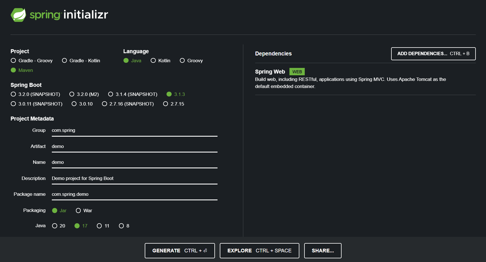
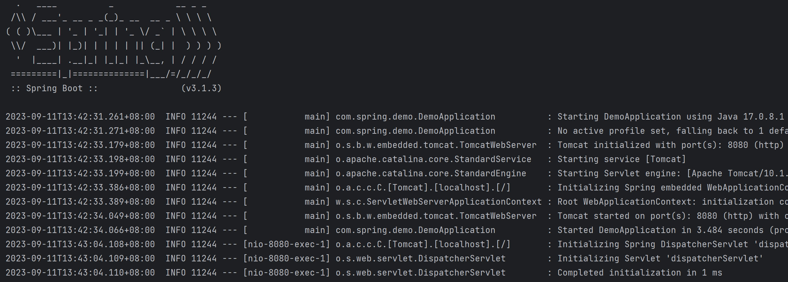
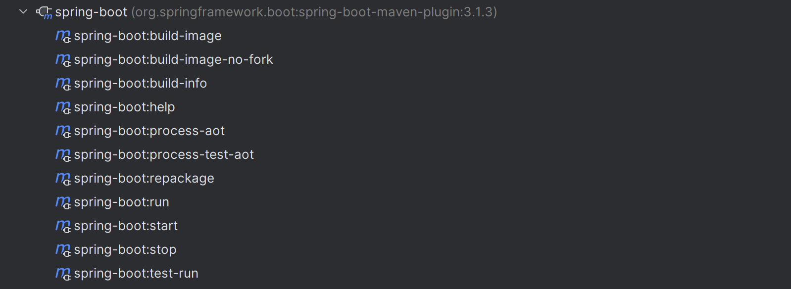

# Spring Boot Quickstart

> Spring Boot makes it easy to create stand-alone, production-grade Spring based Applications that
> you can "just run".

Spring Boot可以轻松创建独立的，可一键运行的生产级Spring应用。

## 准备工作

1. IDE: Intellij IDEA, Visual Studio Code, Spring Tools
2. JDK: Spring官方推荐 BellSoft Liberica JDK 17

## 初始化Spring Boot项目

通过[start.spring.io](https://start.spring.io/)创建Spring Boot项目，如下图：



## Hello World

在DemoApplication.java中添加如下代码；

```java
package com.spring.demo;

import org.springframework.boot.SpringApplication;
import org.springframework.boot.autoconfigure.SpringBootApplication;

import org.springframework.web.bind.annotation.GetMapping;
import org.springframework.web.bind.annotation.RequestParam;
import org.springframework.web.bind.annotation.RestController;

@SpringBootApplication
@RestController
public class DemoApplication {

  @GetMapping("/hello")
  public String hello(@RequestParam(value = "name", defaultValue = "World") String name) {
    return String.format("Hello %s!", name);
  }

  public static void main(String[] args) {
    SpringApplication.run(DemoApplication.class, args);
  }

}
```

新增的hello方法接收一个名为name的参数，并返回Hello %{name}。

注解@RestController告诉Spring这段代码描述了一个应该在网络上提供的端点(即API接口)。

注解@GetMapping("/hello")告诉Spring使用hello方法响应在地址localhost:8080:/hello上接收到的请求。

注解@ReqeustParam告诉Spring期望获取请求中一个名为name的参数值，但如果请求中没有提供该参数值，那么将默认使用"
World"作为参数值。

## 运行Spring Boot

```shell
// 1. 直接启动
mvn spring:boot run --quiet

// 2. 打包发布
mvn clean package -DskipTests
java -jar target/demo-0.0.1-SNAPSHOT.jar
```



Spring Boot既可以直接启动，也可以打包发布。
通过上述启动日志可以看到Spring Boot启动成功。

Spring Boot内置的Apache Tomcat服务器充当了Web服务器，并在本地主机的8080端口上监听请求。

最后，在浏览器上输入URL测试：

```
http://localhost:8080/hello -> Hello World!
http://localhost:8080/hello?name=ZhangSan -> Hello ZhangSan!
```

## pom.xml简述

当前demo继承自spring-boot-starter-parent，表明了这是一个Spring Boot项目。

```xml

<parent>
  <groupId>org.springframework.boot</groupId>
  <artifactId>spring-boot-starter-parent</artifactId>
  <version>3.1.3</version>
  <relativePath/> <!-- lookup parent from repository -->
</parent>
<groupId>com.spring</groupId>
<artifactId>demo</artifactId>
<version>0.0.1-SNAPSHOT</version>
<name>demo</name>
```

spring-boot-starter-parent继承自spring-boot-dependencies。

```xml

<parent>
  <groupId>org.springframework.boot</groupId>
  <artifactId>spring-boot-dependencies</artifactId>
  <version>3.1.3</version>
</parent>
<artifactId>spring-boot-starter-parent</artifactId>
<packaging>pom</packaging>
<name>spring-boot-starter-parent</name>
```

而spring-boot-dependencies涵盖了大量的spring组件以及第三方常用库。

截取部分依赖列表，完整内容可直接查看pom文件。

```xml
<dependency>
  <groupId>org.springframework.graphql</groupId>
  <artifactId>spring-graphql-test</artifactId>
  <version>${spring-graphql.version}</version>
</dependency>
<dependency >
  <groupId>org.springframework.hateoas</groupId>
  <artifactId>spring-hateoas</artifactId>
  <version>${spring-hateoas.version}</version>
</dependency>
<dependency>
  <groupId>org.springframework.kafka</groupId>
  <artifactId>spring-kafka</artifactId>
  <version>${spring-kafka.version}</version>
</dependency>
<dependency>
  <groupId>org.springframework.kafka</groupId>
  <artifactId>spring-kafka-test</artifactId>
  <version>${spring-kafka.version}</version>
</dependency>
```

spring-boot-starter-web依赖开启了项目的web功能

```xml
<dependency>
  <groupId>org.springframework.boot</groupId>
  <artifactId>spring-boot-starter-web</artifactId>
</dependency>
```

spring-boot-starter-test依赖包含了测试需要的库

```xml
<dependency>
  <groupId>org.springframework.boot</groupId>
  <artifactId>spring-boot-starter-test</artifactId>
  <scope>test</scope>
</dependency>
```

spring-boot-maven-plugin提供了如下maven goal。



可以看到spring-boot:run就是由此插件提供。

## 使用 Jetty 替代 Tomcat

```xml
<dependency>
  <groupId>org.springframework.boot</groupId>
  <artifactId>spring-boot-starter-web</artifactId>
  <exclusions>
    <exclusion>
      <groupId>org.springframework.boot</groupId>
      <artifactId>spring-boot-starter-tomcat</artifactId>
    </exclusion>
  </exclusions>
</dependency>

<dependency>
  <groupId>org.springframework.boot</groupId>
  <artifactId>spring-boot-starter-jetty</artifactId>
</dependency>
```
Spring Boot从Tomcat切换到Jetty需要将Tomcat的依赖从spring-boot-starter-web中移除，再将spring-boot-starter-jetty添加到项目的依赖中，表示开启Jetty。

需要注意的是此处需要将Servlet API从6.0.0版本降低至5.0.0
```xml
<jakarta-servlet.version>5.0.0</jakarta-servlet.version>
```
在pom中修改servlet的版本号从而覆盖spring-boot-dependencies中的6.0.0版本。这一问题在下面的链接中有所说明

https://github.com/spring-projects/spring-boot/wiki/Spring-Boot-3.0.0-RC2-Release-Notes#jetty