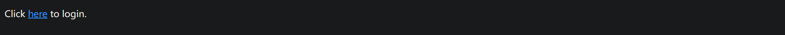
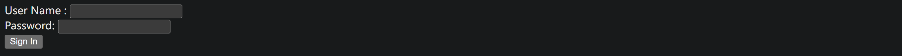
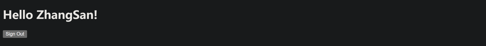

# Create a Simple Web Application

## 准备工作

使用Spring initializr初始化项目时添加Spring Web， Thymeleaf。

## 创建一个 Web Controller

Spring通过@Controller处理HTTP请求，可以使用@Controller指定一个Spring controller。
```java
import org.springframework.stereotype.Controller;
import org.springframework.ui.Model;
import org.springframework.web.bind.annotation.GetMapping;
import org.springframework.web.bind.annotation.RequestParam;

@Controller
public class GreetingController {

  @GetMapping("/greeting")
  public String greeting(@RequestParam(name = "name", required = false, defaultValue = "World") String name, Model model) {
    model.addAttribute("name", name);
    return "greeting";
  }

}
```
@GetMapping, @RequestParam将HTTP GET请求以及请求中的name参数分别映射到greeting()方法和其name参数。

name的值被添加到了Model中，这样name的值就能被view模板访问到。在这个demo中我们将使用Thymeleaf模板。

## 创建第一个HTML页面

Thymeleaf会在服务器端对HTML页面进行渲染。
```html
<!DOCTYPE HTML>
<html xmlns:th="http://www.thymeleaf.org">
<head> 
    <title>Getting Started: Serving Web Content</title> 
    <meta http-equiv="Content-Type" content="text/html; charset=UTF-8" />
</head>
<body>
    <p th:text="'Hello, ' + ${name} + '!'" />
</body>
</html>
```
Thymeleaf会解析greeting.html将其中th:text中的${name}替换成Model中的name值。

运行项目后，打开浏览器输入localhost:8080/greeting即可看到页面显示Hello World！了。

## Spring Boot DevTools 热启动

接下来我们将添加更多的页面以及代码，每次重启spring boot会成为一个繁琐的过程。

```xml
<plugin>
  <groupId>org.springframework.boot</groupId>
  <artifactId>spring-boot-maven-plugin</artifactId>
  <configuration>
    <addResources>true</addResources>
  </configuration>
</plugin>
```
将addResources设置为true，spring boot会把src/main/resources文件夹添加到classpath中，这样可以保证Spring boot devtools可以监控到页面文件的变动。

## Spring MVC 配置

我们再添加两个页面home.html，login.html和hello.html，然后通过Spring MVC配置view controller和页面的映射关系。

```java
@Configuration
public class MvcConfig implements WebMvcConfigurer {

  @Override
  public void addViewControllers(ViewControllerRegistry registry) {
    registry.addViewController("/home").setViewName("home");
    registry.addViewController("/").setViewName("home");
    registry.addViewController("/hello").setViewName("hello");
    registry.addViewController("/login").setViewName("login");
  }
}
```
当我们浏览器中访问/home和 / 时, 会访问home.html. /login会访问login.html。

```html
<body>
    <p>Click <a th:href="@{/login}">here</a> to login.</p>
</body>
```
home.html中我们设置了超链接定向到/login。

```html
<body>
<h1 th:inline="text">Hello <span th:remove="tag" sec:authentication="name">thymeleaf</span>!</h1>
<form th:action="@{/logout}" method="post">
    <input type="submit" value="Sign Out"/>
</form>
</body>
```
hello页面和greeting页面功能类似。hello中的name值会从login的表单中获取，另外加入一个logout的功能。

## Spring Security

现在当某个用户访问/greeting时会直接访问到greeting.html页面，即便他还没有登录。

我们可以通过Spring Security防止这种情况的发生。
```xml
<dependency>
  <groupId>org.springframework.boot</groupId>
  <artifactId>spring-boot-starter-security</artifactId>
</dependency>
<dependency>
  <groupId>org.thymeleaf.extras</groupId>
  <artifactId>thymeleaf-extras-springsecurity6</artifactId>
</dependency>

<dependency>
  <groupId>org.springframework.security</groupId>
  <artifactId>spring-security-test</artifactId>
  <scope>test</scope>
</dependency>
```

WebSecurityConfig会确保只有授权的用户可以访问到greeting页面
```java
@Configuration
@EnableWebSecurity
public class WebSecurityConfig {

  @Bean
  public SecurityFilterChain securityFilterChain(HttpSecurity http) throws Exception {
    http
        .authorizeHttpRequests((requests) -> requests
            .requestMatchers("/", "/home").permitAll()
            .anyRequest().authenticated()
        )
        .formLogin((form) -> form
            .loginPage("/login")
            .permitAll()
        )
        .logout((logout) -> logout.permitAll());
    return http.build();
  }

  @Bean
  public UserDetailsService userDetailsService() {
    UserDetails user =
        User.withDefaultPasswordEncoder()
            .username("ZhangSan")
            .password("Password")
            .roles("USER")
            .build();
    return new InMemoryUserDetailsManager(user);
  }
}
```
securityFilterChain()方法定义了哪些页面可以被未授权的用户直接访问，除此之外的页面都需要授权访问。

如果用户在未登录之前访问其他需授权的页面，都将被重定向到loginPage, 此处即/login。即使greeting页面没有在MvcConfig中配置，看似其他三个页面并无关联，Spring Security也会阻止其未授权访问。

userDetailsService会在内存中存储单个用户的信息，包括他的角色USER,以及他的用户名和密码。

如果用户在login页面中的输入匹配userDetailsService中的用户，则登录成功。

login.html的主体代码如下：
```html
<body>
    <div th:if="${param.error}">
        Invalid username and password.
    </div>
    <div th:if="${param.logout}">
        You have been logged out.
    </div>
    <form th:action="@{/login}" method="post">
        <div><label> User Name : <input type="text" name="username"/> </label></div>
        <div><label> Password: <input type="password" name="password"/> </label></div>
        <div><input type="submit" value="Sign In"/></div>
    </form>
</body>
```

## 运行结果

访问localhost:8080/或localhost:8080。


访问localhost:8080/greeting会被直接重定向到login页面


登录成功后会返回你在登入之前访问的页面。

如果是从home页面跳转到login页面则返回home，如果是从greeting页面跳转到login则返回greeting。


对于错误的用户信息输入，已经logout可自行验证。