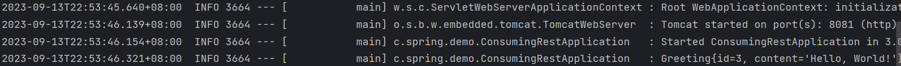

# Consuming A RESTful Web Service

## 启动RESTful Service的生产者

将Building A RESTful Web Service打包启动，以此作为RESTful API的生产者。

启动后我们就可以访问localhost:8080/greeting了。

```json
{
  "id": 2,
  "content": "Hello, World!"
}
```

定义消费侧的资源类Greeting

```java
@JsonIgnoreProperties(ignoreUnknown = true)
public record Greeting(long id, String content) {

  @Override
  public String toString() {
    return "Greeting{" +
        "id=" + id +
        ", content='" + content + '\'' +
        '}';
  }
}
```

## 使用RestTemplate消费RESTful API

```java
@SpringBootApplication
public class ConsumingRestApplication {

  private static final Logger log = LoggerFactory.getLogger(ConsumingRestApplication.class);

  public static void main(String[] args) {
    SpringApplication.run(ConsumingRestApplication.class, args);
  }

  @Bean
  public RestTemplate restTemplate(RestTemplateBuilder builder) {
    return builder.build();
  }

  @Bean
  public CommandLineRunner run(RestTemplate restTemplate) throws Exception {
    return args -> {
      Greeting greeting = restTemplate.getForObject(
          "http://localhost:8080/greeting", Greeting.class);
      log.info(greeting.toString());
    };
  }

}
```
我们先构建RestTemplate实例, 接着将生产端的API转换成Greeting资源类。最后打印资源类。

