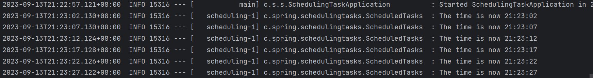

# Scheduling Tasks

## 创建一个定期的任务

```java
@Component
public class ScheduledTasks {
  private static final Logger log = LoggerFactory.getLogger(ScheduledTasks.class);
  private static final SimpleDateFormat dateFormat = new SimpleDateFormat("HH:mm:ss");

  @Scheduled(fixedRate = 5000)
  public void reportCurrentTime() {
    log.info("The time is now {}", dateFormat.format(new Date()));
  }

}
```

@Scheduled(fixedRate = 5000) 表明了reportCurrentTime会5s执行一次。

## 开启Scheduling

```java
@SpringBootApplication
@EnableScheduling
public class SchedulingTasksApplication {
  public static void main(String[] args) {
    SpringApplication.run(SchedulingTasksApplication.class);
  }
}
```

@EnableScheduling确保Spring开启个后台任务执行ScheduledTask。

## 单元测试
添加awaitility异步测试框架。
```xml
<dependency>
  <groupId>org.awaitility</groupId>
  <artifactId>awaitility</artifactId>
  <version>4.2.0</version>
  <scope>test</scope>
</dependency>
```

```java
@SpringBootTest
class ScheduledTasksTest {

  @SpyBean
  ScheduledTasks tasks;

  @Test
  public void reportCurrentTime() {
    await().atMost(Durations.TEN_SECONDS).untilAsserted(() -> {
      verify(tasks, atLeast(2)).reportCurrentTime();
    });
  }

}
```
运行测试代码10s, ScheduledTasks执行2次。

## 运行结果

