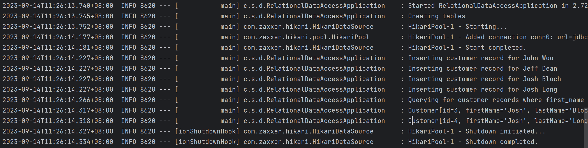

# Accessing Relational Data Using JDBC

## 准备工作

初始化Spring Boot项目时添加JDBC API和H2 Database。

```xml
<dependency>
  <groupId>org.springframework.boot</groupId>
  <artifactId>spring-boot-starter-jdbc</artifactId>
</dependency>

<dependency>
  <groupId>com.h2database</groupId>
  <artifactId>h2</artifactId>
  <scope>runtime</scope>
</dependency>
```

H2 Database是一个内置关系型数据库，这里用来做demo非常适合。 使用JDBC API连接到H2。

## 创建一个 Customer 对象

```java
public record Customer(long id, String firstName, String lastName) {

  @Override
  public String toString() {
    return String.format(
        "Customer[id=%d, firstName='%s', lastName='%s']",
        id, firstName, lastName);
  }

}
```

## 存储以及检索数据

```java
@SpringBootApplication
public class RelationalDataAccessApplication implements CommandLineRunner {

  private static final Logger log = LoggerFactory.getLogger(RelationalDataAccessApplication.class);

  public static void main(String args[]) {
    SpringApplication.run(RelationalDataAccessApplication.class, args);
  }

  @Autowired
  JdbcTemplate jdbcTemplate;

  @Override
  public void run(String... strings) {

    log.info("Creating tables");

    jdbcTemplate.execute("DROP TABLE customers IF EXISTS");
    jdbcTemplate.execute("CREATE TABLE customers(id SERIAL, first_name VARCHAR(255), last_name VARCHAR(255))");

    // Split up the array of whole names into an array of first/last names
    List<Object[]> splitUpNames = Stream.of("John Woo", "Jeff Dean", "Josh Bloch", "Josh Long")
        .map(name -> name.split(" "))
        .collect(Collectors.toList());

    // Use a Java 8 stream to print out each tuple of the list
    splitUpNames.forEach(name -> log.info(String.format("Inserting customer record for %s %s", name[0], name[1])));

    // Uses JdbcTemplate's batchUpdate operation to bulk load data
    jdbcTemplate.batchUpdate("INSERT INTO customers(first_name, last_name) VALUES (?,?)", splitUpNames);

    log.info("Querying for customer records where first_name = 'Josh':");
    jdbcTemplate.query(
        "SELECT id, first_name, last_name FROM customers WHERE first_name = ?", new Object[]{"Josh"},
        (rs, rowNum) -> new Customer(rs.getLong("id"), rs.getString("first_name"), rs.getString("last_name"))
    ).forEach(customer -> log.info(customer.toString()));
  }
}
```
Spring提供了JdbcTemplate让JDBC操作关系型数据库变得简单。我们不用关心JDBC怎么连接数据库，怎么做错误处理。这些Spring都已经帮你搞定了。

因为使用的数H2数据库，JdbcTemplate可以自动创建一个connection。

RelationalDataAccessApplication实现了CommandLineRunner接口，该接口需要我们实现run()方法。当Spring Boot启动后，该方法会运行。

在run()方法中，我们实现了数据库的CREATE, INSERT, SELECT操作。

## 运行结果

