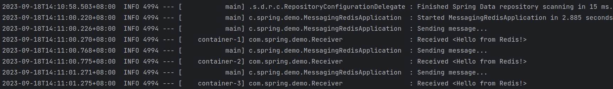

# Messaging with Redis

## 准备工作

1. 安装并启动Redis Server
2. 为Spring Boot项目添加Spring Data Redis依赖

## 创建一个Redis消息接收器

```java
public class Receiver {

  private static final Logger LOGGER = LoggerFactory.getLogger(Receiver.class);
  private AtomicInteger counter = new AtomicInteger();

  public void receiveMessage(String message) {
    LOGGER.info("Received <" + message + ">");
    counter.incrementAndGet();
  }

  public int getCount() {
    return counter.get();
  }

}
```

Receiver是一个用来接受消息的简单对象。在这里我们用receiveMessage()方法接受消息。

## 注册Listener并发送消息

Spring Data Redis提供了发送和接受信息的组件：

1. Connection Factory：使Redis template和Message listener container连接到Redis Server。
2. Message Listener Container：注册Receiver。
3. Redis template：用以发送消息。

```java

@SpringBootApplication
public class MessagingRedisApplication {

  private static final Logger LOGGER = LoggerFactory.getLogger(MessagingRedisApplication.class);

  @Bean
  RedisMessageListenerContainer container(RedisConnectionFactory connectionFactory,
                                          MessageListenerAdapter listenerAdapter) {
    RedisMessageListenerContainer container = new RedisMessageListenerContainer();
    container.setConnectionFactory(connectionFactory);
    container.addMessageListener(listenerAdapter, new PatternTopic("chat"));
    return container;
  }

  @Bean
  MessageListenerAdapter listenerAdapter(Receiver receiver) {
    return new MessageListenerAdapter(receiver, "receiveMessage");
  }

  @Bean
  Receiver receiver() {
    return new Receiver();
  }

  @Bean
  StringRedisTemplate template(RedisConnectionFactory connectionFactory) {
    return new StringRedisTemplate(connectionFactory);
  }

  public static void main(String[] args) throws InterruptedException {
    ApplicationContext ctx = SpringApplication.run(MessagingRedisApplication.class, args);
    StringRedisTemplate template = ctx.getBean(StringRedisTemplate.class);
    Receiver receiver = ctx.getBean(Receiver.class);

    while (receiver.getCount() < 3) {
      LOGGER.info("Sending message...");
      template.convertAndSend("chat", "Hello from Redis!");
      Thread.sleep(500L);
    }
    System.exit(0);

  }

}
```

在main函数中我们可以看到Redis Template循环发送信息给chat，而这个chat就是注册了Receiver的listener。

## 运行结果

