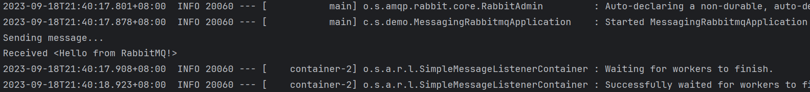

# Messaging with RabbitMQ

## 准备工作

1. 安装并启动RabbitMQ
2. 为Spring Boot项目添加Spring for RabbitMQ依赖

## 创建RabbitMQ消息接收器

```java
import java.util.concurrent.CountDownLatch;
import org.springframework.stereotype.Component;

@Component
public class Receiver {

  private CountDownLatch latch = new CountDownLatch(1);

  public void receiveMessage(String message) {
    System.out.println("Received <" + message + ">");
    latch.countDown();
  }

  public CountDownLatch getLatch() {
    return latch;
  }

}
```

## 注册Listener

```java
package com.example.messagingrabbitmq;

import org.springframework.amqp.core.Binding;
import org.springframework.amqp.core.BindingBuilder;
import org.springframework.amqp.core.Queue;
import org.springframework.amqp.core.TopicExchange;
import org.springframework.amqp.rabbit.connection.ConnectionFactory;
import org.springframework.amqp.rabbit.listener.SimpleMessageListenerContainer;
import org.springframework.amqp.rabbit.listener.adapter.MessageListenerAdapter;
import org.springframework.boot.SpringApplication;
import org.springframework.boot.autoconfigure.SpringBootApplication;
import org.springframework.context.annotation.Bean;

@SpringBootApplication
public class MessagingRabbitmqApplication {

  static final String topicExchangeName = "spring-boot-exchange";

  static final String queueName = "spring-boot";

  @Bean
  Queue queue() {
    return new Queue(queueName, false);
  }

  @Bean
  TopicExchange exchange() {
    return new TopicExchange(topicExchangeName);
  }

  @Bean
  Binding binding(Queue queue, TopicExchange exchange) {
    return BindingBuilder.bind(queue).to(exchange).with("foo.bar.#");
  }

  @Bean
  SimpleMessageListenerContainer container(ConnectionFactory connectionFactory,
      MessageListenerAdapter listenerAdapter) {
    SimpleMessageListenerContainer container = new SimpleMessageListenerContainer();
    container.setConnectionFactory(connectionFactory);
    container.setQueueNames(queueName);
    container.setMessageListener(listenerAdapter);
    return container;
  }

  @Bean
  MessageListenerAdapter listenerAdapter(Receiver receiver) {
    return new MessageListenerAdapter(receiver, "receiveMessage");
  }

  public static void main(String[] args) throws InterruptedException {
    SpringApplication.run(MessagingRabbitmqApplication.class, args).close();
  }

}
```
和上一节的Redis Message类似，这里也需要用Message Listener Container注册Listener， 连接到RabbitMQ。

## 发送消息

```java
@Component
public class Runner implements CommandLineRunner {

  private final RabbitTemplate rabbitTemplate;
  private final Receiver receiver;

  public Runner(Receiver receiver, RabbitTemplate rabbitTemplate) {
    this.receiver = receiver;
    this.rabbitTemplate = rabbitTemplate;
  }

  @Override
  public void run(String... args) throws Exception {
    System.out.println("Sending message...");
    rabbitTemplate.convertAndSend(MessagingRabbitmqApplication.topicExchangeName, "foo.bar.baz", "Hello from RabbitMQ!");
    receiver.getLatch().await(10000, TimeUnit.MILLISECONDS);
  }

}
```
我们通过CommandLineRunner让项目在启动的时候发送一条测试消息。

## 运行结果

