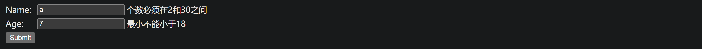

# Validating Form Input

## 创建一个 PersonForm 类

```java
import jakarta.validation.constraints.Min;
import jakarta.validation.constraints.NotNull;
import jakarta.validation.constraints.Size;

public class PersonForm {

  @NotNull
  @Size(min = 2, max = 30)
  private String name;

  @NotNull
  @Min(18)
  private Integer age;

  public String getName() {
    return this.name;
  }

  public void setName(String name) {
    this.name = name;
  }

  public Integer getAge() {
    return age;
  }

  public void setAge(Integer age) {
    this.age = age;
  }

  public String toString() {
    return "Person(Name: " + this.name + ", Age: " + this.age + ")";
  }
}
```

@NotNull, @Size, @Min定义了变量值的规范。

## 创建 Controller

```java
@Controller
public class WebController implements WebMvcConfigurer {

  @Override
  public void addViewControllers(ViewControllerRegistry registry) {
    registry.addViewController("/results").setViewName("results");
  }

  @GetMapping("/")
  public String showForm(PersonForm personForm) {
    return "form";
  }

  @PostMapping("/")
  public String checkPersonInfo(@Valid PersonForm personForm, BindingResult bindingResult) {

    if (bindingResult.hasErrors()) {
      return "form";
    }

    return "redirect:/results";
  }
}
```
checkPersonInfo会检查表单提供的personForm变量是否符合要求，如果不符合停留在form.html，如果符合就跳转到results.html

## html页面

form.html
```html
<!DOCTYPE HTML>
<html xmlns:th="http://www.thymeleaf.org">
    <body>
        <form action="#" th:action="@{/}" th:object="${personForm}" method="post">
            <table>
                <tr>
                    <td>Name:</td>
                    <td><input type="text" th:field="*{name}" /></td>
                    <td th:if="${#fields.hasErrors('name')}" th:errors="*{name}">Name Error</td>
                </tr>
                <tr>
                    <td>Age:</td>
                    <td><input type="text" th:field="*{age}" /></td>
                    <td th:if="${#fields.hasErrors('age')}" th:errors="*{age}">Age Error</td>
                </tr>
                <tr>
                    <td><button type="submit">Submit</button></td>
                </tr>
            </table>
        </form>
    </body>
</html>
```
form.html显示一个提交name和age的表单，提交的内容会构建一个PersonForm实例。如果name和age不符合validation的要求，name会显示相应的错误提示。

results.html
```html
<html>
	<body>
		Congratulations! You are old enough to sign up for this site.
	</body>
</html>
```

## 运行结果

